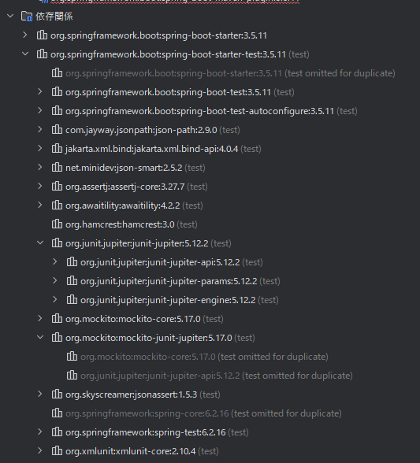
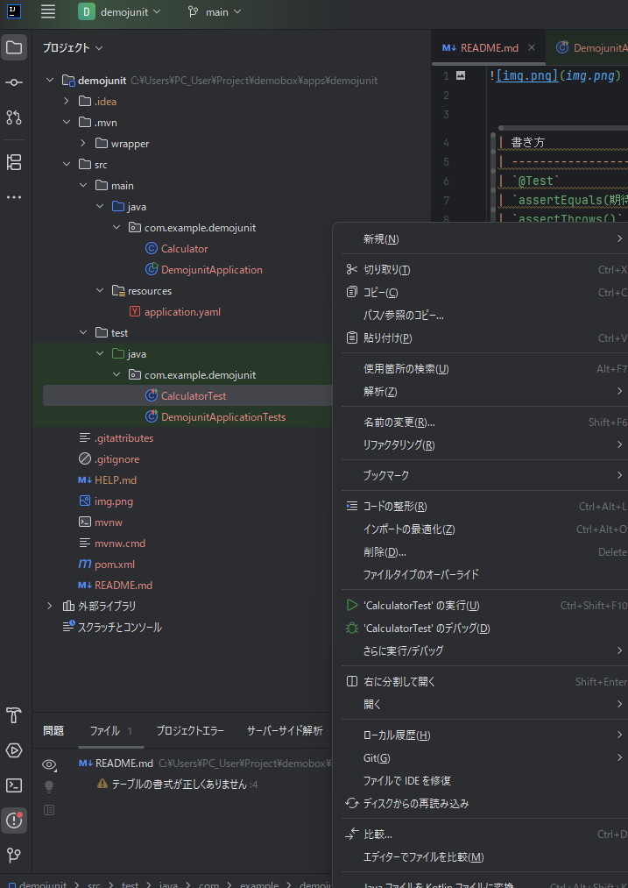
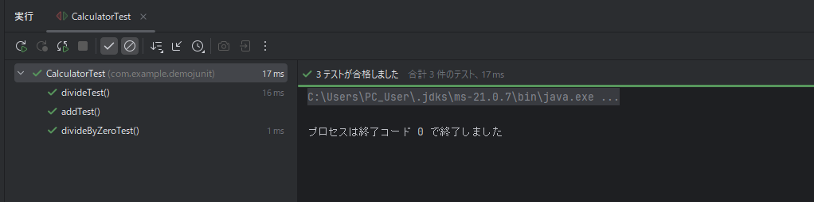

| 書き方                       | 意味            |
| ------------------------- | ------------- |
| `@Test`                   | これはテストメソッドですよ |
| `assertEquals(期待値, 実際の値)` | 値が同じか確認       |
| `assertThrows()`          | 例外が出ることを確認    |
JUnit 5 の仕様でテストメソッドは void でなければならない

## 単体テスト実行
```
ctrl shift F10
```


完全成功
* ✅ 「テストが合格しました」
* ✅ 合計 3 件のテスト
* ✅ 全部緑チェック
* ✅ プロセスは終了コード 0



# Unitテストから学ぶ極意
基本は「テスト対象クラス1つにつき、テストクラス1つ」
* どのクラスのテストか一目で分かる
* 修正時に迷わない
* 責任範囲が明確

「1クラス1メソッド」にする必要はないが、  
責務が1つならOK。責務が増えたら分ける

| サイト                                | PDF対応                | 備考                  |
| ---------------------------------- | -------------------- | ------------------- |
| Kindle（Amazon）                     | ❌ 基本不可               | EPUB形式。PDF出力は公式ではない |
| **楽天Kobo**                         | ❌ 基本不可               | 多くが専用リーダー形式         |
| **DMM電子書籍**                        | ❌ ×                  | 専用ビューア              |
| **Google Play ブックス**               | 📌 可能な場合あり           | 作品によってPDF対応あり       |
| **BookWalker**                     | 📌 PDF対応あり           | 購入時に選択可能            |
| **技術書典（PDF版販売あり）**                 | 📌 あり                | 同人技術書がPDFで買える       |
| **O’Reilly Japan**                 | 📌 PDF選択可            | 技術書の公式PDFあり         |
| **Packt Publishing**               | 📌 PDFあり             | 英語技術書               |
| **Leanpub**                        | 📌 PDF/EPUB/MOBI 選べる | 技術書に最適              |
| **Safari Books Online (O’Reilly)** | 📌 PDFあり             | サブスク読み放題            |

| 項目        | EPUB        | PDF        |
| --------- | ----------- | ---------- |
| レイアウト     | 文字サイズで変わる   | 固定（紙と同じ）   |
| 文字サイズ変更   | ◎ 自由        | △ 拡大のみ     |
| スマホ読みやすさ  | ◎           | △          |
| PCでの見やすさ  | ○           | ◎          |
| コードの見やすさ  | △ 改行崩れることあり | ◎ そのまま     |
| 印刷        | × 不向き       | ◎ そのまま印刷可  |
| ChatGPT連携 | △（変換必要）     | ◎ そのままアップ可 |


